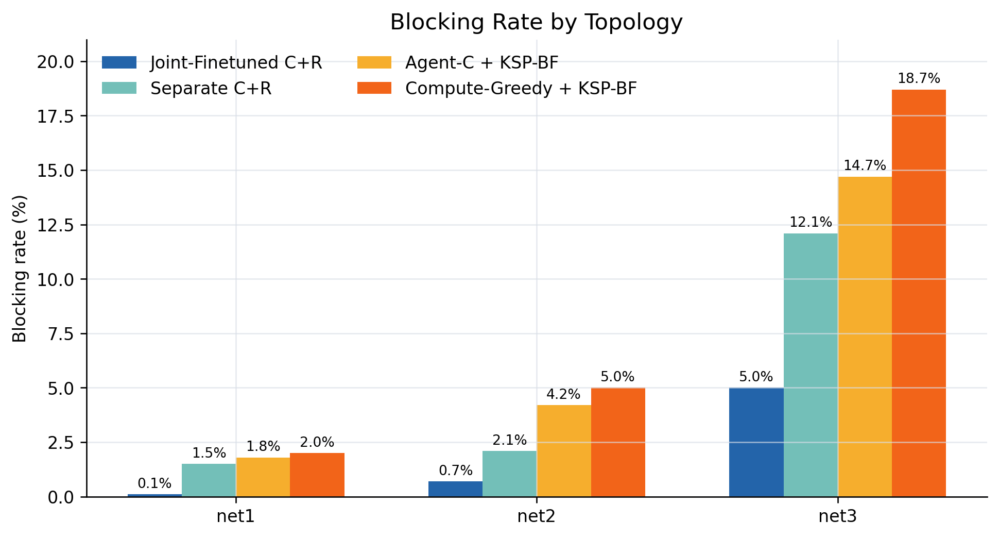
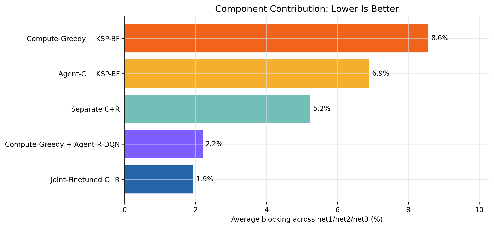
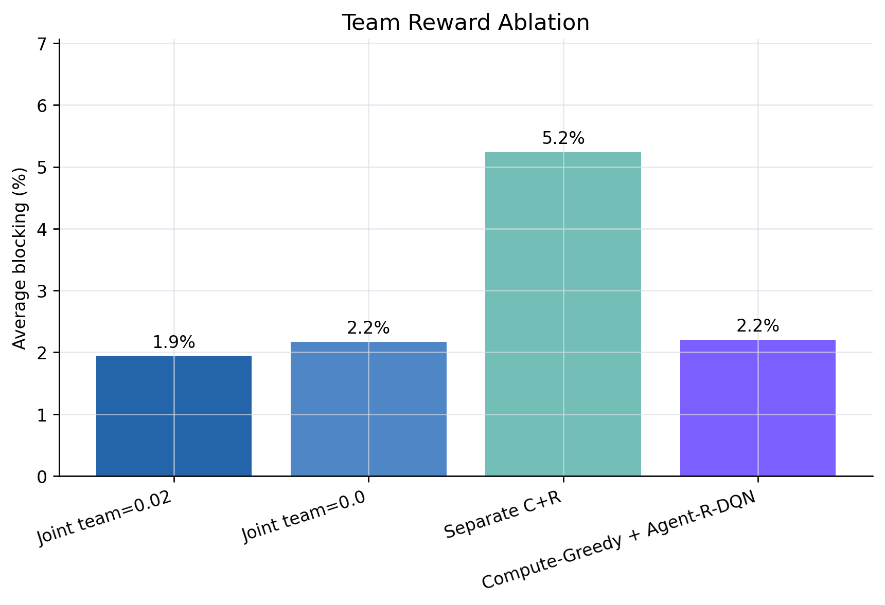
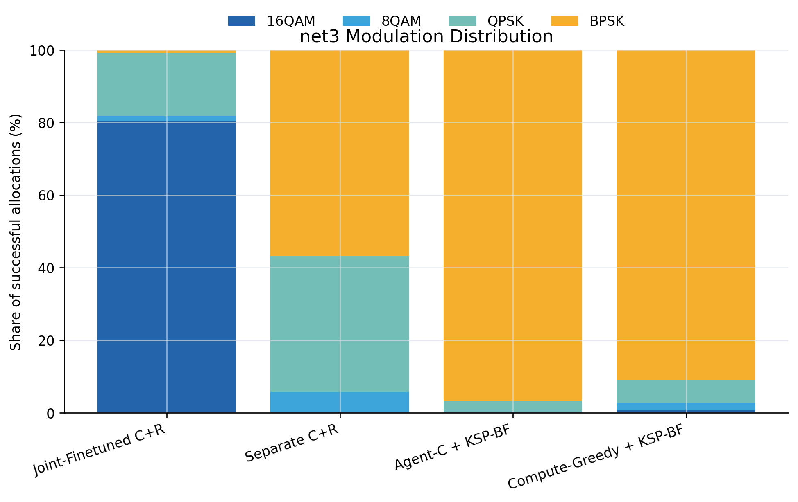
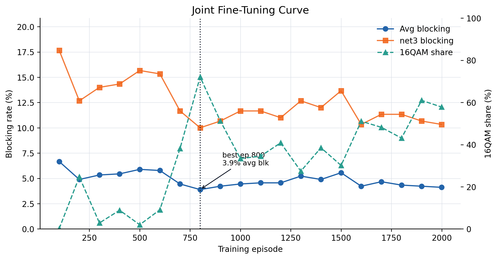

# SA-HMARL: Spectrum-Aware Hierarchical Multi-Agent RL

频谱感知的分层双智能体 DNN 切分与 RMSA 协同优化框架。

> 基于练手项目 [DNN_Agent](https://github.com/ddriveb/DNN_Agent) 的底层基础设施（光网络、MEC、KSP），全新构建的科研项目。

## 项目结构

```
sa_hmarl/
├── sa_hmarl/
│   ├── network/          # 光网络层
│   │   ├── optical_network.py   # 增强版光网络（频谱矩阵、分配/释放、统计）
│   │   ├── modulation.py        # 调制格式: BPSK/QPSK/8QAM/16QAM + reach 表
│   │   ├── spectrum_blocks.py   # 候选连续频谱块提取（Agent-R 动作空间）
│   │   └── ksp.py               # K-最短路径（待实现）
│   ├── mec/              # MEC 服务器层
│   │   ├── server.py            # 单服务器: 计算容量、负载、排队时延 EMA
│   │   └── cluster.py           # 服务器集群
│   ├── dnn/              # DNN 切分模型（待实现）
│   ├── env/              # 事件驱动 SMDP 环境（Phase 0 核心）
│   │   ├── fs_demand.py         # F_{c,j,k,m}^{req} 频隙需求计算
│   │   ├── spectrum_summary.py  # 服务器方向级频谱摘要（Agent-C 输入）
│   │   └── action_mask.py       # Agent-C / Agent-R 动作 Mask
│   ├── agents/           # 双智能体（Phase 1-3）
│   ├── baselines/        # 13 个对比方法
│   └── evaluation/       # 实验评估
├── configs/
│   └── network.yaml      # 网络、调制、KSP、FS 计算参数
├── tests/                # 单元测试
├── experiments/          # 实验数据与结果（不纳入版本控制）
└── notebooks/            # 可视化分析
```

## Phase 0 已完成（增强版仿真环境地基）

| 模块 | 状态 | 说明 |
|------|------|------|
| `network/modulation.py` | ✅ | 调制格式注册表、reach 约束查询 |
| `network/spectrum_blocks.py` | ✅ | 候选频谱块提取（FF/BF/精确匹配） |
| `network/optical_network.py` | ✅ | 增强版光网络：频谱分配、候选块、调制感知 |
| `mec/server.py` | ✅ | MEC 服务器 + 排队时延 EMA |
| `mec/cluster.py` | ✅ | 服务器集群 |
| `env/fs_demand.py` | ✅ | 频隙需求计算：时延预算 → FS 需求 |
| `env/spectrum_summary.py` | ✅ | 增强频谱摘要：LFB 分位数、碎片方差、路径多样性 |
| `env/action_mask.py` | ✅ | Agent-C / Agent-R 动作 Mask + apply_mask |
| `configs/network.yaml` | ✅ | 统一配置文件 |

## 运行测试

```bash
# 所有测试
for f in tests/test_*.py; do python $f; done

# 或逐个运行
python tests/test_modulation.py
python tests/test_spectrum_blocks.py
python tests/test_optical_network.py
python tests/test_fs_demand.py
python tests/test_spectrum_summary.py
python tests/test_action_mask.py
```

## Phase 5 实验结果

> **评估规模**：5 seeds × 20 episodes × 20 requests = 2,000 requests/方法/拓扑。
> **训练设置**：2000 episodes × 30 requests，topologies={net1, net2, net3}，episode-level 交替更新（偶数 C / 奇数 R），warm-start 自 multitopo 预训练 checkpoint。

---

### 5.1 Main Results — Joint-Finetuned vs Separate vs Baselines

| Method | net1 Blk | net2 Blk | net3 Blk | **Avg Blk** | Avg Rwd | AvgFS | Path(km) |
|:-------|---------:|---------:|---------:|------------:|--------:|------:|---------:|
| **Joint-Finetuned C+R** | **0.1%** | **0.7%** | **5.0%** | **1.9%** | 0.212 | 2.17 | 19.82 |
| Separate C+R | 1.5% | 2.1% | 12.1% | 5.2% | 0.245 | 3.01 | 18.10 |
| Agent-C + KSP-BF | 1.8% | 4.2% | 14.7% | 6.9% | 0.316 | 3.22 | 16.09 |
| Compute-Greedy + KSP-BF | 2.0% | 5.0% | 18.7% | 8.6% | 0.350 | 3.24 | 15.75 |

**关键发现**：
- **Joint finetuning 降低 63% blocking**（1.9% vs 5.2%），在 net3 上改善最显著（5.0% vs 12.1%，降低 59%）。
- **AvgFS 从 3.0 降至 2.2**：更紧凑的频谱分配意味着更少的频谱碎片和更低的阻塞。

**调制格式分布（net3，最具区分度的拓扑）**：

| Method | 16QAM | 8QAM | QPSK | BPSK |
|:-------|------:|-----:|-----:|-----:|
| Joint-Finetuned C+R | **80.4%** | 1.3% | 17.5% | 0.8% |
| Separate C+R | 0.1% | 5.8% | 37.3% | 56.9% |
| Agent-C + KSP-BF | 0.3% | — | 3.0% | 96.7% |
| Compute-Greedy + KSP-BF | 0.7% | 2.0% | 6.4% | 91.0% |

- Joint finetuning 后的 Agent-R 学会了**积极使用 16QAM**（最高效调制），而 separate 训练和 KSP-BF 都保守地停留在 BPSK/QPSK。这是性能差距的核心来源。

---

### 5.2 Component Contribution — 谁贡献了性能提升？

| Method | net1 | net2 | net3 | **Avg** | AvgFS | net3 Modulation |
|:-------|------|------|------|--------:|------:|:----------------|
| Joint-Finetuned C+R | 0.1% | 0.7% | 5.0% | **1.9%** | 2.17 | 16QAM 80.4% |
| Separate C+R | 1.5% | 2.1% | 12.1% | 5.2% | 3.01 | BPSK 56.9% |
| Agent-C + KSP-BF | 1.8% | 4.2% | 14.7% | 6.9% | 3.22 | BPSK 96.7% |
| **Compute-Greedy + Agent-R-DQN** | **0.0%** | **0.9%** | **5.7%** | **2.2%** | 2.18 | 16QAM 79.2% |
| Compute-Greedy + KSP-BF | 2.0% | 5.0% | 18.7% | 8.6% | 3.34 | BPSK 91.0% |

**分解分析**：
- **Agent-R 是主要贡献者**：Compute-Greedy + Agent-R-DQN (2.2%) ≈ Joint-Finetuned C+R (1.9%)，说明 joint finetuning 的核心收益来自 **Agent-R 学会了更好的 RMSA 决策**。
- **Agent-C 的 finetuning 有边际贡献**：在 net3 上 Joint (5.0%) vs Compute-Greedy + Agent-R-DQN (5.7%)，学习型 Agent-C 比计算贪心上层策略再降低约 0.7pp。
- **单独 Agent-C 几乎无用**：Agent-C + KSP-BF (6.9%) 甚至不如 Separate C+R (5.2%)，说明没有好的 Agent-R，Agent-C 的切分决策无法转化为端到端收益。

---

### 5.3 Team Reward Ablation — team signal 是否必要？

| Method | net1 | net2 | net3 | **Avg Blk** | AvgFS | net3 16QAM |
|:-------|------|------|------|------------:|------:|-----------:|
| Joint-Finetuned (team=0.02) | 0.1% | 0.7% | 5.0% | **1.9%** | 2.17 | 80.4% |
| Joint-Finetuned (team=0.0) | 0.2% | 0.7% | 5.6% | 2.2% | 2.21 | 57.6% |
| Separate C+R | 1.5% | 2.1% | 12.1% | 5.2% | 2.85 | 0.1% |
| Compute-Greedy + Agent-R-DQN | 0.0% | 0.9% | 5.7% | 2.2% | 2.21 | 79.2% |

**结论**：
- **Team reward 影响微弱但正向**：team=0.02 (1.9%) vs team=0.0 (2.2%)，差距仅 0.3pp。
- **核心收益来自 joint alternating fine-tuning 本身**，而非 team signal。
- **Team reward 的主要作用是引导调制选择**：team=0.02 版本在 net3 上使用 16QAM 的比例（80.4%）显著高于 team=0.0（57.6%）。team signal 作为 success/blocking 反馈的小扰动，帮助 Agent-R 更积极地探索高阶调制。

---

### 5.4 Training Curve — Joint-Finetuned (team=0.02)

> 完整训练曲线数据见 [`experiments/joint_multitopo_training_curve.csv`](experiments/joint_multitopo_training_curve.csv)。
> 训练设置：2000 eps × 30 req/ep，eval 每 100 eps 在 net1/net2/net3 上进行（5 eps × 20 req）。

| Episode | Avg Blk | net1 | net2 | net3 | Avg Rwd | 16QAM | QPSK | BPSK | Best? |
|:-------:|--------:|-----:|-----:|-----:|--------:|------:|-----:|-----:|:-----:|
| 100 | 6.7% | 0.0% | 2.3% | 17.7% | 0.168 | 0.1% | 57.6% | 28.2% | ⭐ |
| 200 | 4.9% | 0.0% | 2.0% | 12.7% | 0.166 | 24.7% | 50.8% | 2.7% | ⭐ |
| 400 | 5.4% | 0.0% | 2.0% | 14.3% | 0.176 | 8.9% | 54.9% | 12.8% | |
| 600 | 5.8% | 0.0% | 2.0% | 15.3% | 0.173 | 9.1% | 39.4% | 13.0% | |
| **800** | **3.9%** | **0.0%** | **1.7%** | **10.0%** | **0.174** | **72.1%** | **3.5%** | **0.0%** | **⭐** |
| 1000 | 4.4% | 0.0% | 1.7% | 11.7% | 0.185 | 33.4% | 28.8% | 1.4% | |
| 1200 | 4.6% | 1.0% | 1.7% | 11.0% | 0.182 | 40.8% | 23.4% | 0.9% | |
| 1400 | 4.9% | 1.0% | 1.7% | 12.0% | 0.190 | 38.5% | 27.7% | 2.7% | |
| 1600 | 4.2% | 0.7% | 1.7% | 10.3% | 0.203 | 51.1% | 22.5% | 0.9% | |
| 1800 | 4.3% | 0.0% | 1.7% | 11.3% | 0.207 | 43.1% | 29.5% | 4.3% | |
| 1999 | 4.1% | 0.7% | 1.3% | 10.3% | 0.209 | 57.8% | 22.8% | 1.8% | |

**曲线观察**：
1. **Best checkpoint @ ep 800**（avg_blocking = 3.9%），之后轻微波动但不再突破。
2. **16QAM 使用率演进**：ep 100 时几乎为 0%（仍以 BPSK/QPSK 为主），ep 800 跃升至 **72%**，标志着 Agent-R 在 joint fine-tuning 中学会了积极使用最高效调制格式。
3. **net3 始终是瓶颈**：blocking 10–18%，远高于 net1/net2 的 0–2%。
4. **Reward 与 blocking 同步改善**：avg reward 从 0.17 (ep 100) 上升至 0.21 (ep 1999)。

---

### 5.5 运行脚本

```bash
cd /mnt/d/project/DNN_Agent
export PYTHONPATH=/mnt/d/project/DNN_Agent/sa_hmarl

# Joint multitopo fine-tuning (team=0.02)
/mnt/d/project/DNN_Agent/.venv/bin/python -m sa_hmarl.training.train_joint_multitopo_alternating \
    --episodes 2000 --requests_per_episode 30 --team_coef 0.02 \
    --eval_freq 100 --log_interval 10 \
    --log_csv sa_hmarl/experiments/joint_multitopo_training_curve.csv

# Joint multitopo evaluation
/mnt/d/project/DNN_Agent/.venv/bin/python -m sa_hmarl.evaluation.eval_joint_multitopo \
    --seeds 42,123,456,789,2024 --episodes 20 --requests_per_episode 20
```

### 5.6 Figures — 方法差异可视化

> 可复现脚本：[`scripts/plot_joint_results.py`](scripts/plot_joint_results.py)。输出目录：[`experiments/figures/`](experiments/figures/)。

```bash
cd /mnt/d/project/DNN_Agent
PYTHONPATH=/mnt/d/project/DNN_Agent/sa_hmarl \
    /mnt/d/project/DNN_Agent/.venv/bin/python sa_hmarl/scripts/plot_joint_results.py
```

**Blocking rate by topology**



**Component contribution**



**Team reward ablation**



**net3 modulation distribution**



**Joint fine-tuning curve**



## 后续阶段

- **Phase 1**: KSP 模块 + 事件驱动 SMDP 环境主循环
- **Phase 2**: Agent-R (RMSA) 预训练
- **Phase 3**: Agent-C (频谱感知切分) 训练
- **Phase 4**: 双 Agent 交替微调
- **Phase 5**: 对比实验 + 消融实验
- **Phase 6**: 论文撰写

## 依赖

```bash
pip install numpy scipy torch networkx pyyaml
```

（复用练手项目的 `.venv` 环境即可）
